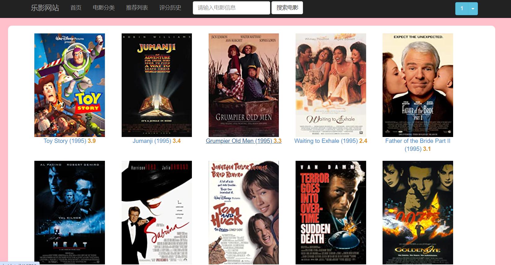
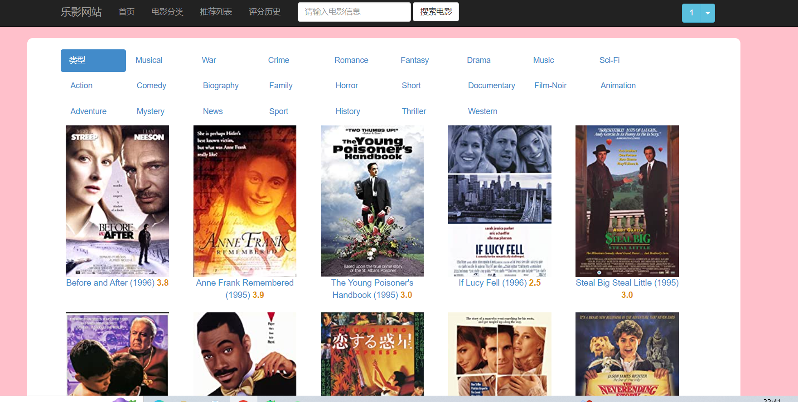
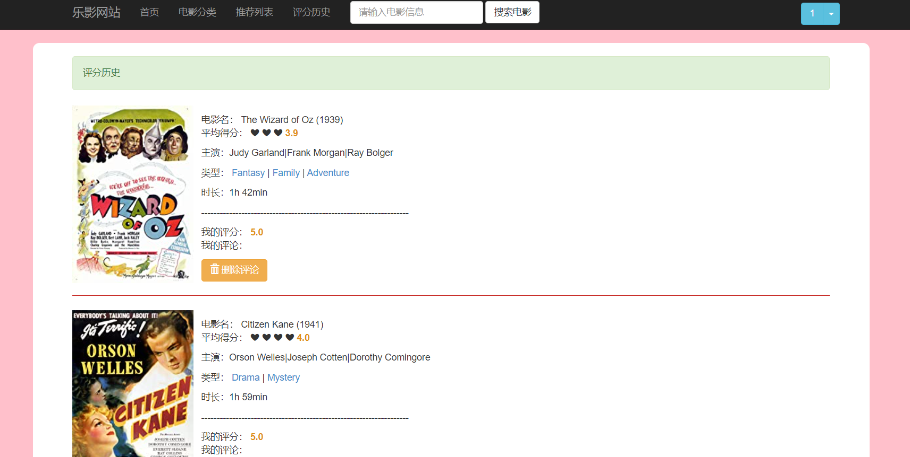
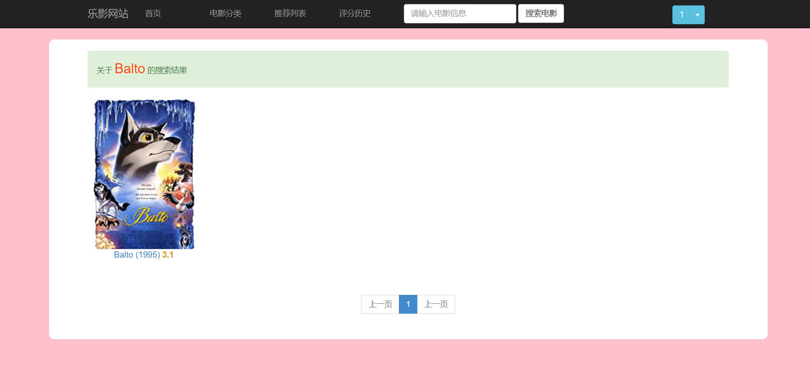
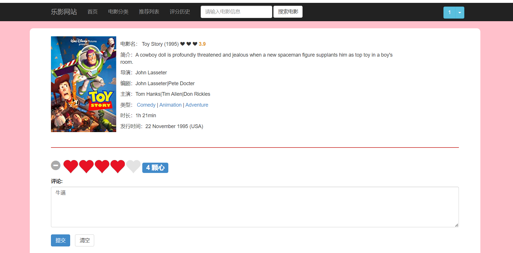
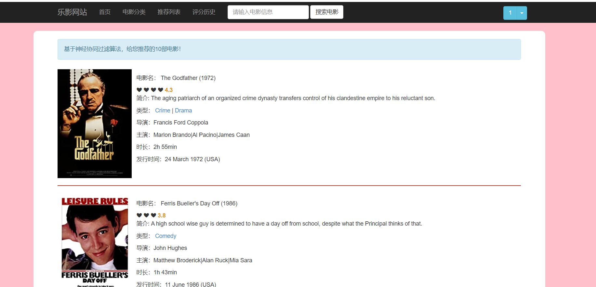

# MovieRecLite - 基于协同过滤的电影推荐系统

本项目为本人的毕业设计，使用 Python 的 Django 框架开发，实现了一个简洁的电影推荐系统。系统基于协同过滤算法，结合评分数据、相似度矩阵与电影信息，提供个性化推荐功能，并通过 Django 模板进行前端页面展示。

## 项目功能 Features

- 用户评分提交界面
- 基于评分数据的协同过滤推荐逻辑（Item-Based）
- 推荐电影的展示页（包括封面、简介等）
- 评分数据和相似度矩阵的加载与处理

## 技术栈 Technology Stack

| 分类   | 技术栈                     |
|--------|----------------------------|
| 后端   | Python 3, Django           |
| 数据   | MySQL, CSV 数据集          |
| 算法   | 基于物品的协同过滤算法     |
| 前端   | HTML, CSS, Django   |
| 工具   | PyCharm,                |

## 项目结构

```plaintext
MoviesRecommend/
├── manage.py                # Django 项目入口
├── movie/                   # 核心应用逻辑
│   ├── views.py             # 推荐算法与请求处理
│   ├── models.py            # 数据库模型
│   ├── forms.py             # 表单定义
│   ├── urls.py              # 路由配置
│   └── static/              # 静态资源（评分数据、电影图片等）
├── templates/               # 页面模板文件
├── movie_recommend.sql      # MySQL 初始化脚本
├── README.md                # 项目说明
```

## 算法说明

本项目采用**基于物品的协同过滤算法（Item-Based Collaborative Filtering）**，通过预处理评分数据生成电影之间的相似度矩阵，结合用户的评分记录推荐相似影片。

推荐逻辑流程：
1. 用户对若干电影评分
2. 系统从相似度矩阵中查找相似电影
3. 基于相似权重与评分生成推荐列表
4. 在推荐结果页展示推荐内容与封面

## 项目运行

> 开发环境：Python 3.9 + Django 4.x  
> 启动项目步骤（确保已安装好环境）：

```bash
python manage.py makemigrations
python manage.py migrate
python manage.py runserver
```

浏览器访问：
```
http://127.0.0.1:8000/
```

## 项目展示

首页界面示例：



分类界面示例：



评分历史界面示例：


搜索界面示例：


影片界面示例：


推荐界面示例：



## 个人说明

本人为计算机专业毕业生，正在系统学习 Web 全栈开发与实际项目部署经验。

如有建议欢迎 issue 或邮件交流，谢谢阅读。
